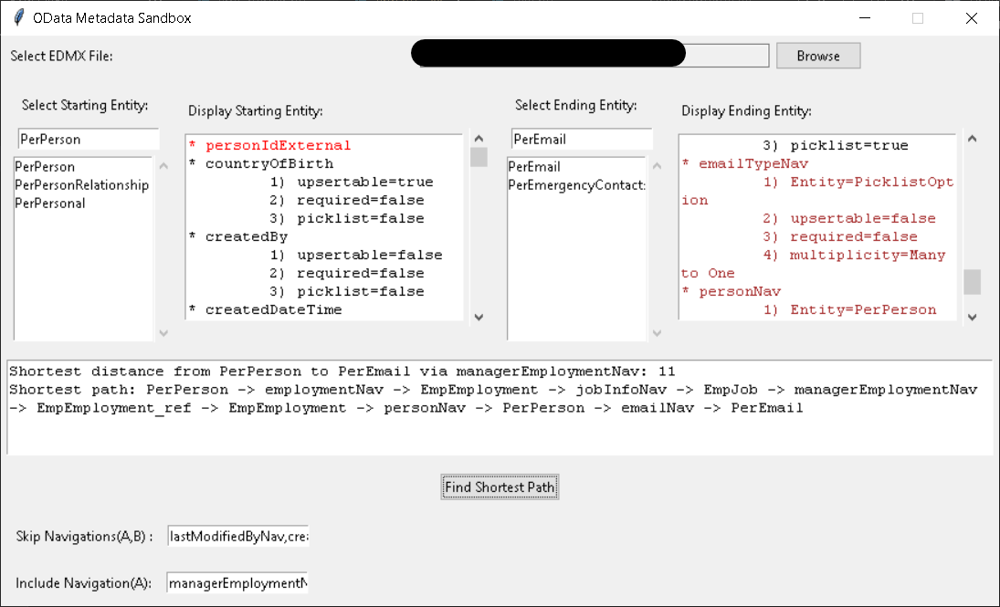
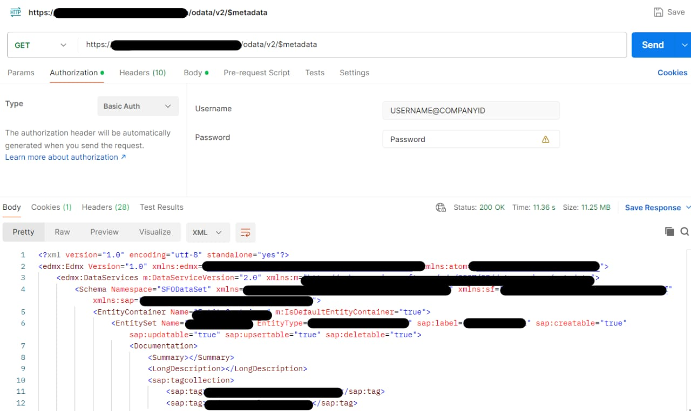

# Successfactors OData Sandbox

## Overview

The Successfactors OData Sandbox is a Python application that provides a user interface for analyzing OData metadata and finding the shortest path between entities using a graph-based approach.




## Features

- **Entity Metadata Analysis:** Browse and analyze OData entity metadata from XML files.
- **Shortest Path Finder:** Find the shortest path between two entities, considering specified navigation entities and excluding others.
- **User-Friendly Interface:** Utilizes Tkinter for a simple and interactive user interface.

## Fetching OData Metadata

To retrieve the entire metadata of an instance, you can use the OData API call: https://<hostname>/odata/v2/$metadata

### Hostnames for Different Environments

Here is a list of hostnames based on SAP Support Knowledge Base [Note 2215682](https://userapps.support.sap.com/sap/support/knowledge/en/2215682):

- **Development Environment (Example):**
  - Hostname: `https://api68sales.successfactors.com`

- **Quality Assurance Environment (Example):**
  - Hostname: `https://api4preview.sapsf.com`

- **Production Environment (Example):**
  - Hostname: `https://api4.successfactors.com`

### Using Postman

You can also use [Postman](https://www.postman.com/) to make the API call:



1. Open Postman.

2. Set the HTTP method to `GET`.

3. Enter the API endpoint in the URL bar: https://<hostname>/odata/v2/$metadata

4. Select basic authentication where username, company ID, and password are combined into a string as such: username@company ID:password


5. Click on the "Send" button to make the API call.

6. Save the received metadata EMDX file body as a XML file and later use it in the appliaction. 

This will fetch the entire metadata of the OData instance, providing detailed information about entities, properties, and relationships.

Note: Make sure to replace `<hostname>` with the actual hostname corresponding to the environment you are working on.


## Project Structure


<body>
    <pre>
        <code>
Successfactors-OData-Sandbox/
|-- gui/
|   |-- __init__.py
|   └── app.py
|-- odata_utils/
|   |-- __init__.py
|   |-- graph_utils.py
|   └── xml_parser.py
|-- dist/
|   └── main.exe
|-- main.py
|-- requirements.txt
|-- setup.py
        </code>
    </pre>
</body>


- **`gui/`**: Contains the Tkinter-based GUI application.
- **`odata_utils/`**: Utilities for handling OData metadata and graph-related operations.
- **`main.py`**: Entry point of the application.
- **`requirements.txt`**: Lists the project dependencies.
- **`setup.py`**: Configuration for setting up the project.

## Getting Started

1. **Clone the repository:**

    ```bash
    git clone https://github.com/ShayanMajumder/Successfactors-OData-Sandbox.git
    ```

2. **Navigate to the project directory:**

    ```bash
    cd Successfactors-OData-Sandbox
    ```

3. **Create and activate a virtual environment:**

    ```bash
    python -m venv venv
    source venv/bin/activate      # On Linux/macOS
    .\venv\Scripts\activate       # On Windows
    ```

4. **Install dependencies:**

    ```bash
    pip install -r requirements.txt
    ```

5. **Run the application:**

    ```bash
    python main.py
    ```

6. **Deactivate the virtual environment (when done):**

    ```bash
    deactivate
    ```

## Creating Executables with PyInstaller

You can use [PyInstaller](https://www.pyinstaller.org/) to create standalone executables for your Python applications on Windows and macOS. Follow the steps below to create executables for the Successfactors OData Sandbox:

### 1. Install PyInstaller

Open a terminal and install PyInstaller using the following command:

```bash
pip install pyinstaller 
```

### 2. Navigate to the Project Directory
Go to the directory where your main.py file is located.

```bash
cd /path/to/Successfactors-OData-Sandbox
```

### 3. Create Executable for Windows or macOS
Run the following command to create an executable for Windows:

```bash
pyinstaller --onefile --windowed main.py
```
This command generates a standalone executable (main.exe in Windows) or executable (main.app in macOS) in the dist directory.


### 4.  Run the Executable
Navigate to the dist directory and run the generated executable:

For Windows: Double-click on main.exe.
For macOS: Double-click on main.app.
Now, you can distribute the executable files without requiring users to have Python installed.

Note: PyInstaller might include some additional files in the dist directory. You can distribute the entire directory for the application to work properly.


## Usage

1. Select an XML file containing OData metadata.
2. Browse and analyze entity metadata.
3. Specify starting and ending entities.
4. Optionally, include/exclude navigation entities.
5. Click "Find Shortest Path" to discover the shortest path.

## Contributing

Feel free to contribute to this project! Fork the repository, make your changes, and submit a pull request.

## License

This project is licensed under the MIT License - see the [LICENSE](LICENSE) file for details.
