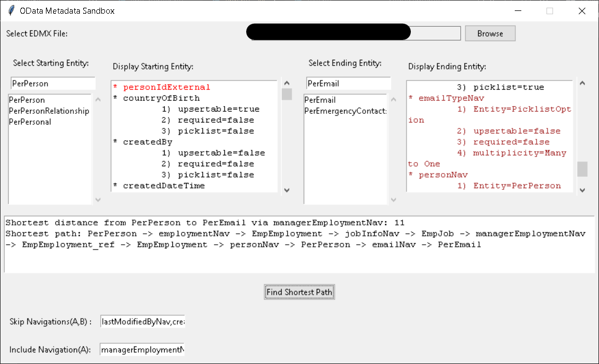

# Successfactors OData Sandbox

## Overview

The Successfactors OData Sandbox is a Python application that provides a user interface for analyzing OData metadata and finding the shortest path between entities using a graph-based approach.




## Features

- **Entity Metadata Analysis:** Browse and analyze OData entity metadata from XML files.
- **Shortest Path Finder:** Find the shortest path between two entities, considering specified navigation entities and excluding others.
- **User-Friendly Interface:** Utilizes Tkinter for a simple and interactive user interface.

## Project Structure

Successfactors-OData-Sandbox/
├── gui/
│   └── app.py
├── odata_utils/
│   ├── __init__.py
│   ├── graph_utils.py
│   ├── xml_parser.py
├── main.py
├── requirements.txt
└── setup.py


- **`gui/`**: Contains the Tkinter-based GUI application.
- **`odata_utils/`**: Utilities for handling OData metadata and graph-related operations.
- **`main.py`**: Entry point of the application.
- **`requirements.txt`**: Lists the project dependencies.
- **`setup.py`**: Configuration for setting up the project.

## Getting Started

1. **Clone the repository:**

    ```bash
    git clone https://github.com/ShayanMajumder/Successfactors-OData-Sandbox.git
    ```

2. **Navigate to the project directory:**

    ```bash
    cd Successfactors-OData-Sandbox
    ```

3. **Install dependencies:**

    ```bash
    pip install -r requirements.txt
    ```

4. **Run the application:**

    ```bash
    python main.py
    ```

## Usage

1. Select an XML file containing OData metadata.
2. Browse and analyze entity metadata.
3. Specify starting and ending entities.
4. Optionally, include/exclude navigation entities.
5. Click "Find Shortest Path" to discover the shortest path.

## Contributing

Feel free to contribute to this project! Fork the repository, make your changes, and submit a pull request.

## License

This project is licensed under the MIT License - see the [LICENSE](LICENSE) file for details.
